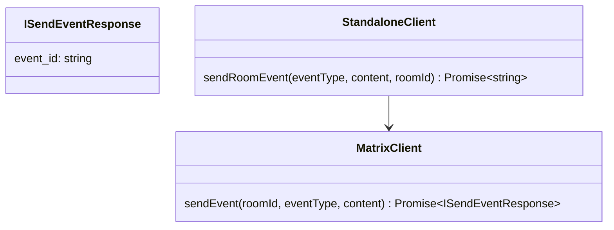
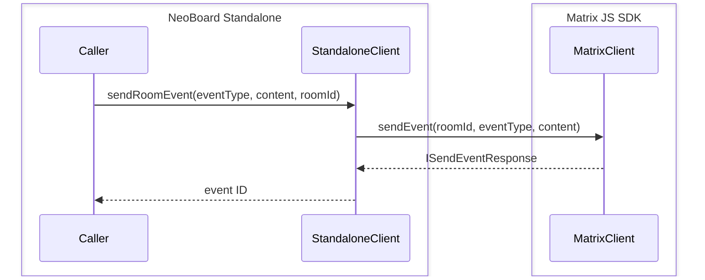

# ADR001: Matrix JS SDK as Matrix SDK

Status: accepted

## Context

This project provides a standalone version of [the NeoBoard Matrix widget](https://github.com/nordeck/matrix-neoboard).
Matrix widgets are hosted by Matrix clients. The clients handle communication with the Matrix APIs.
On the other hand the standalone version needs to talk directly to the Matrix APIs.
While this can be implemented from scratch a Matrix SDK can make things much easier here.

## Decision

We will use [Matrix JS SDK](https://github.com/matrix-org/matrix-js-sdk/) as Matrix SDK.
To mitigate the impact of SDK changes, we will wrap `MatrixClient` with a domain-specific client.

Example:

## Alternatives

The following sections present the alternatives we have considered in different categories and the reasons for not using them.

### Matrix Rust SDK

This is most likely the future reference implementation for a Matrix SDK.
It is going to replace various SDKs for some clients, including Element.
At the time of writing this, the SDK is in „alpha state“.

We did not choose the Matrix Rust SDK for the following reasons

- Breaking changes are to be expected until the stable release
- It is not easily usable with our JavaScript/TypeScript stack. Making it work takes a lot of effort.
- Widget support is incomplete
- It would introduce a new language to our tech stack

### Matrix React SDK

This is more or less the Element Web client.

We did not choose the Matrix React SDK for the following reasons

- It would be tightly coupled to the Element Web development including breaking changes
- When pulling in parts of the SDK we would most likely end up pulling in everything
- We would need to use the Compound design and won't be able to easily implement our own

### Trixnity SDK

This is a Kotlin based SDK.

We did not choose the Trixnity SDK for the following reasons

- WASM support is in alpha status. Making it work takes a lot of effort.
- No support for widgets at all
- It would introduce a new langauge to our tech stack

## Consequences

We use what Matrix JS SDK offers to talk to the Matrix APIs.
Examples are `MatrixClient` or utility functions.

However, we will not call `MatrixClient` directly.
If need be, we extend our domain-specific client interface and implement a wrapper function.

Using the Matrix JS SDK can save a lot of time when implementing the Matrix APIs.
Though, NeoBoard Standalone will then be affected by SDK changes.
