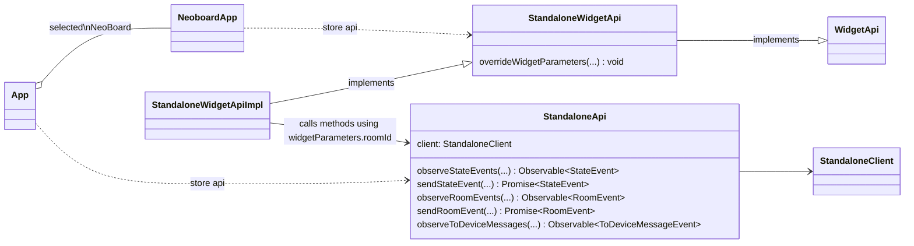

# ADR002: Running widget in a standalone App

Status: accepted

## Context

NeoBoard as a Widget requires a Matrix client host (such as Element Web) to run and doesn't have the possibility to
be executed outside of this context, in what we call a standalone mode.

The Neoboard widget uses [Widget API](https://github.com/nordeck/matrix-widget-toolkit/blob/main/packages/api/src/api/types.ts)
from [Matrix Widget Toolkit][matrix-widget-toolkit] for all the communications with the homeserver.

Matrix Widget Toolkit provides an implementation of the Widget API: [WidgetApiImpl](https://github.com/nordeck/matrix-widget-toolkit/blob/main/packages/api/src/api/WidgetApiImpl.ts)
that uses Matrix [Widget API](https://github.com/matrix-org/matrix-widget-api/blob/master/src/WidgetApi.ts)
(aka Matrix Widget API) from [matrix-widget-api][matrix-widget-api] to send actions via the `postMessage` API.

Widget API from Matrix Widget Toolkit hides usages of Matrix Widget API, so there is no direct dependency
between NeoBoard widget and the Matrix Widget API. This allows to have a possibility of another
Widget API implementation that doesn't depend on Matrix Widget API without changing NeoBoard widget.

Widget API from Matrix Widget Toolkit is better suited for use in widgets than plain Matrix Widget API.

For NeoBoard to be available as a standalone application, we are looking into ways that can enable running it
and other widgets outside of existing Matrix clients. We want to provide functionality that is not available
via Widget API and / or is difficult to implement there, to embed widget into another standalone application that
provides functionality on top of what the widget could provide, to make a NeoBoard independent from Matrix client
(not the matrix APIs) to have better UI / UX. However, we are bounded by Widget API and NeoBoard implementation
and try to make standalone features running without really changing these APIs.

## Decision

### Running NeoBoard in a standalone mode

We will provide an implementation of Widget API that runs in a standalone mode. This requires the availability
of operations to: receive / observe / send room and state events, observe / send to device messages,
observe turn servers, read event relations, upload files, and will ignore the capabilities requests,
as they are not required in this context.

Currently, the aim is to provide operations that are needed for the NeoBoard widget to work outside of Matrix Client,
that means that some operations that are for example related to modals are not going to be implemented
while this could be completed in future if needed.

### Standalone Widget API implementation

Standalone Widget API implementation will have no dependency to Matrix Widget API. The exception here is that some
types that are used to pass parameters or return the result could be still used in several cases.
Introducing our own types here means just duplicating types from Matrix Widget API that
could be done later if needed without really changing the client code.

Standalone Widget API implementation will use Matrix SDK to communicate to the homeserver.
See [ADR001: Matrix JS SDK as Matrix SDK][adr001].

### Standalone API

We will need to communicate with the homeserver to send / receive events that are specific to standalone application
and only indirectly related to the widget. So we would need an API that could allow us to build additional
functionality. Ideally it should be the same or similar API that we are using in the widget itself, so that
we can reuse the same configurations, utility code, concepts while working on functionality that is not part
of the NeoBoard widget but could be already addressed in other widgets.

The standalone NeoBoard is similar to the NeoDateFix widget in the way that we operate across
all the rooms of the user and are interested only in rooms that have the `net.nordeck.whiteboard` widget type set in
the room state.

### Neoboard as a React component

We will use NeoBoard as a React component directly in the standalone application. This is not supported out of
the box by the NeoBoard widget. NeoBoard has also few hard coupling to the running as a widget mode.

### Store API

Neoboard as a React component depends on the redux store that holds state events and
provides selectors to access the state. It is essential to make sure that store is in a proper state.

We will use the same store to hold any additional state that is needed by standalone application and access it
using hooks and selectors in a way we do it in NeoBoard widget or any other widget (Meetings, Poll, BarCamp)
developed by Nordeck. In particular a NeoDateFix widget has a lot of store / selectors usages that work with a
similar room structure, so we could reuse existing know-how.

### Alternatives

#### Run NeoBoard as a widget

This is what Matrix Client like Element is doing. This would require proper implementation of the widget hosting
logic in a standalone application. This would also mean that we are much more dependant to matrix-widget-api and
would have to follow the existing process if we want to change anything there, that is cumbersome. The benefit
here is that widgets are added dynamically and are running in an iframe, but we don't need that for NeoBoard
or Nordeck widgets.

#### Mock Matrix Widget API and provide instance to Widget API

Since Widget API depends on Matrix Widget API we could make and instance of Matrix Widget API and make it to work
with homeserver client-server api. But it quickly ends up with not too much sense, because matrix widget api
is coupled to postMessage API that we don't necessary have to work with, it assumes that widget is
running inside of Matrix Client and have many optional roomId parameters that are resolved to real roomId
inside of Matrix Client. Matrix Widget API is also not that optimized to work in comparison to Widget API
from the Matrix Widget Toolkit. So Matrix Widget API looks like an layer of abstraction that we
can avoid to work with and have no extra code that depends of matrix-widget-api.

## Consequences

### Widget API implicit roomId(s) and Standalone API

Standalone application is not coupled to a specific room in contrast to widget that runs in a room.

Widget API allows to pass `roomIds` to get the events for specific rooms or use `Symbols.AnyRoom` to get
events from any room the user is allowed to access. It is also possible to have this parameter to be
`undefined`, in this case Matrix Client returns events for the room where the widget was added.

We have to make sure that Standalone API has explicit `roomIds` since it is not attached to a particular room.

### Widget API roomId parameter could not be changed

Widget API has `widgetParameters` that are readonly. That is by design, because widget belongs to a
particular room.

We added an operation to change the current room, to make Widget API work when the user switches rooms.
Creation of a new Widget API is problematic, because Store API takes an instance of Widget API
during initialization.

As a result we have to force refetch of widget endpoints that hold the data for the previous room when
the room changes. It forces the endpoints to receive events using a new room id.

### Neoboard dependency to widget environment

NeoBoard had few usages of `extractWidgetParameters` that assumes url parameters. It was possible to refactor
to use `widgetParameters` from `widgetApi` that work both in widget and standalone modes.

### NeoBoard react sdk

NeoBoard repository was changed to monorepo with a new `react-sdk` package that exports all
NeoBoard components, utilities, store apis.

### Store Api

Standalone app and the widget they both reuse the same store.

We are providing both `widgetApi` and `standaloneApi` to `thunk.extraArgument` when configuring redux store.
Therefore `widgetApi` is used in widget endpoints and standalone app defines it's own endpoints
in similar way but using `standaloneApi`.

While it is possible to use endpoints from the widget inside of standalone it is not that useful
because we have to access many of the same events but across any room.

### Standalone APIs

The standalone implementation has the following APIs / components:

StandaloneClient
: API for communication to the homeserver. A minimum API facilitating standalone apps and running widget in a
standalone mode. Has explicit `roomId(s)` parameters.
This API is implemented by `MatrixStandaloneClient` using `MatrixClient` from [matrix-js-sdk][matrix-js-sdk].

StandaloneApi
: Provides additional methods to access events on top of StandaloneClient.
This API is implemented by `StandaloneApiImpl`.

StandaloneWidgetApi
: Extends `WidgetApi` for the widget that runs in a standalone mode. Adds `overrideWidgetParameters`
to override parameters of already initialized Widget API (used to change the current room).
This API is implemented by `StandaloneWidgetApiImpl`.

NeoBoardApp
: A React NeoBoard component exported by `react-sdk` package from the NeoBoard repository.
It's Store API uses `WidgetApi` that is an instance of `StandaloneWidgetApiImpl`.

App
: Standalone application where user can see a list of NeoBoards and select a specific one to open.
Has it's own Store API to observe events from **any** room. Store API uses `StandaloneApi` to communicate
to the homeserver.

[matrix-widget-toolkit]: https://github.com/nordeck/matrix-widget-toolkit
[matrix-widget-api]: https://github.com/matrix-org/matrix-widget-api/
[matrix-js-sdk]: https://github.com/matrix-org/matrix-js-sdk/
[adr001]: ./adr001-matrix-js-sdk-as-matrix-sdk.md
