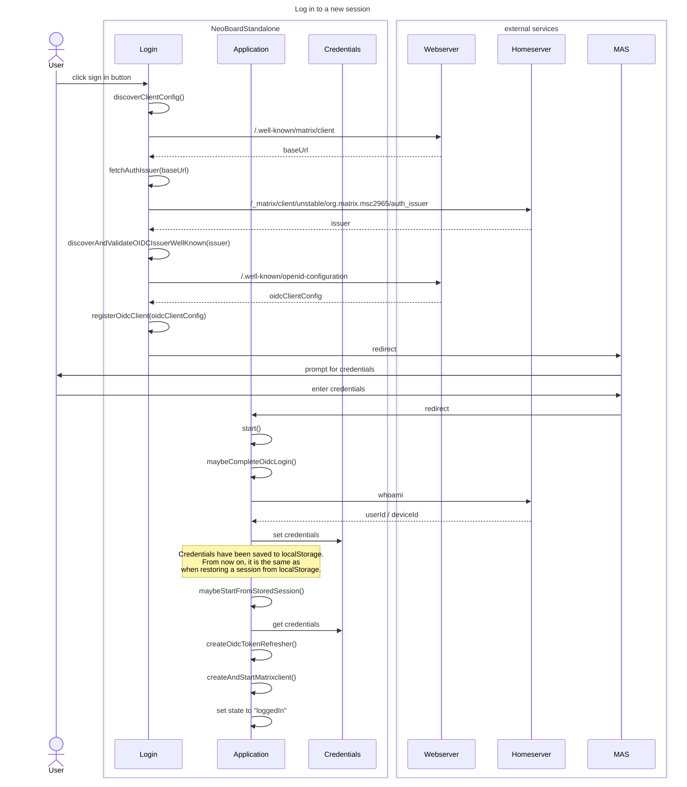

# Neoboard Standalone Architecture docs

## Login flow

The following sequence diagram shows the a fresh login flow.

```mermaid
sequenceDiagram
  title: Log in to a new session

  actor User

  box NeoBoardStandalone
    participant Login
    participant Application
    participant Credentials
  end

  box external services
    participant Webserver
    participant Homeserver
    participant MAS
  end

  User ->> Login: click sign in button
  Login ->> Login: discoverClientConfig()
  Login ->> Webserver: /.well-known/matrix/client
  Webserver -->> Login: baseUrl
  Login ->> Login: fetchAuthIssuer(baseUrl)
  Login ->> Homeserver: /_matrix/client/unstable/org.matrix.msc2965/auth_issuer
  Homeserver -->> Login: issuer
  Login ->> Login: discoverAndValidateOIDCIssuerWellKnown(issuer)
  Login ->> Webserver: /.well-known/openid-configuration
  Webserver -->> Login: oidcClientConfig
  Login ->> Login: registerOidcClient(oidcClientConfig)
  Login ->> MAS: redirect
  MAS ->> User: prompt for credentials
  User ->> MAS: enter credentials
  MAS ->> Application: redirect
  Application ->> Application: start()
  Application ->> Application: maybeCompleteOidcLogin()
  Application ->> Homeserver: whoami
  Homeserver -->> Application: userId / deviceId
  Application ->> Credentials: set credentials
  Note over Application: Credentials have been saved to localStorage.<br />From now on, it is the same as<br />when restoring a session from localStorage.
  Application ->> Application: maybeStartFromStoredSession()
  Application ->> Credentials: get credentials
  Application ->> Application: createOidcTokenRefresher()
  Application ->> Application: createAndStartMatrixclient()
  Application ->> Application: set state to "loggedIn"
```
