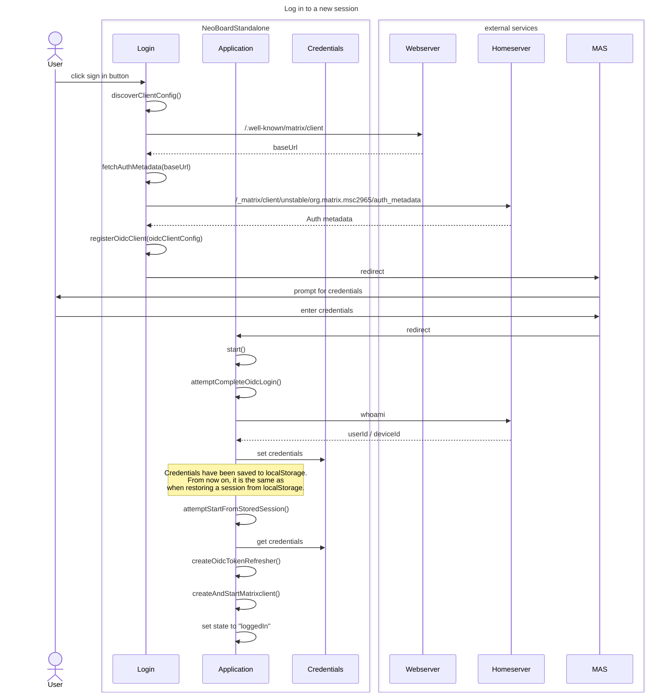

# Neoboard Standalone Architecture docs

## OIDC Login flow

The following sequence diagram shows the a fresh login flow.

## Legacy API SSO Login Flow

Alternatively, `SSO` is available via `Legacy API` as described
in [the Matrix Specification](https://spec.matrix.org/v1.16/client-server-api/#client-login-via-sso).
